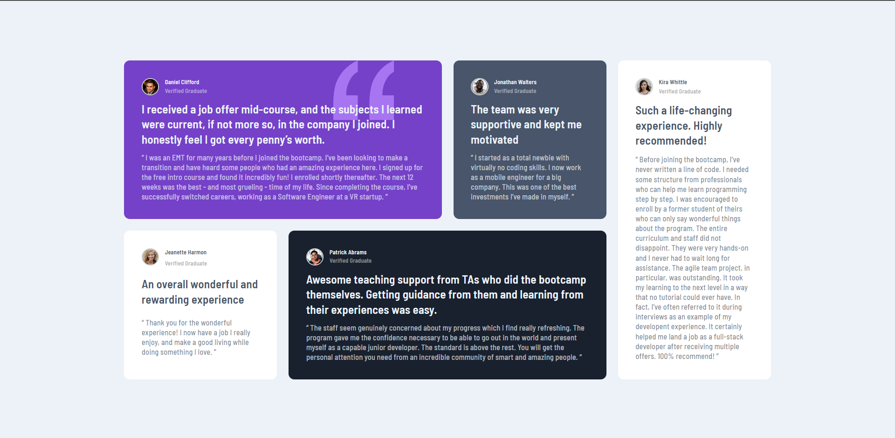

# grid-testimonial
# Frontend Mentor - Testimonials grid section

# Frontend Mentor - Testimonials grid section solution

This is a solution to the [Testimonials grid section challenge on Frontend Mentor](https://www.frontendmentor.io/challenges/testimonials-grid-section-Nnw6J7Un7). Frontend Mentor challenges help you improve your coding skills by building realistic projects. 

## Table of contents

- [Overview](#overview)
  - [The challenge](#the-challenge)
  - [Screenshot](#screenshot)
  - [Links](#links)
- [My process](#my-process)
  - [Built with](#built-with)
  - [What I learned](#what-i-learned)
  - [Continued development](#continued-development)
- [Author](#author)

## Overview

### The challenge

Users should be able to:

- View the optimal layout depending on their device's screen size
- See hover states for interactive elements

### Screenshot

### Links

- Solution URL: [Grid-testimonial - GITHUB](https://github.com/Samjolas/grid-testimonial)
- Live Site URL: [Grid-testimonial - LIVE](https://samjolas.github.io/grid-testimonial)

## My process

- Evaluate the design
- write README
- input all variables

### Built with

- Semantic HTML5 markup
- BEM METHODOLOGY
- CSS (SASS)
- Responsive Design

### What I learned

### Continued development

- Keep improving my css skills and also my JavaScript skills. 

- Code more often 

## Author

- Frontend Mentor - [@Samjolas](https://www.frontendmentor.io/profile/Samjolas)

